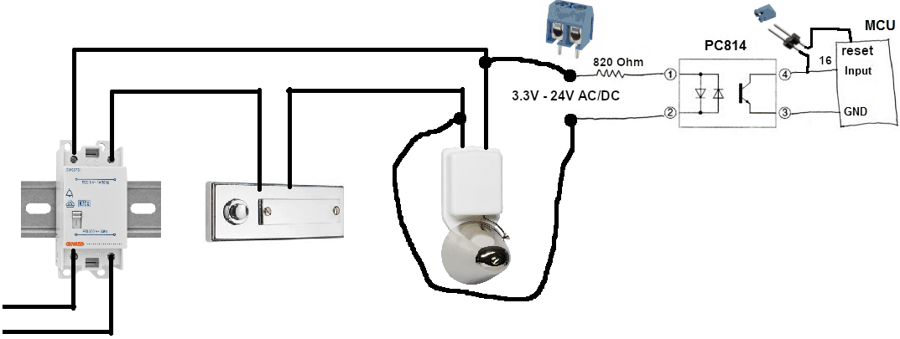

# Power on
After power on the a WiFi AP for configuration is open for 30 seconds.

```
SSID: doorbell
PASS: do0R6311
```
# First setup
The WiFi AP for configuration is open as long as the configuration is not done.

Please set WiFi and FritzBox credentials.

# Screw terminal
Input (on GPIO16) works from 3.3V to 24V AC/DC.

Set jumper to reset pin to reset the controller if door bell is pressed (if needed).

# Serial debug
USB serial connection 115200 8N1.

# Hardware details
* Wemos D1 Mini ESP32
* PC814 with 820 Ohm
* GPIO16 with internal pullup and PC814 to GND
* Jumper from GPIO16 to RESET (not used)

# Circuit diagram


# See other projects
The project is very loosely based on:

https://www.heise.de/select/ct/2017/17/1502995489716437

https://www.reichelt.de/magazin/projekte/smarte-tuerklingel/

https://github.com/belzetrigger/esp-FritzKlingel
